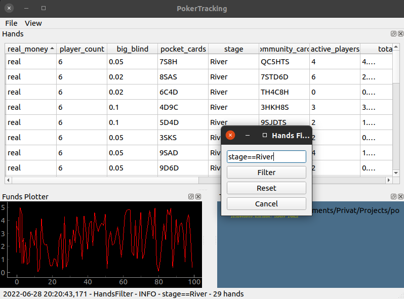

# PyQt Pokertracking



This is a hobby project for keeping track of the hands played in online poker via simple screen shots.

Run to generate dummy images:
```
python generate_dummy_images.py
```

Start with:

```
python pokertracking.py
```